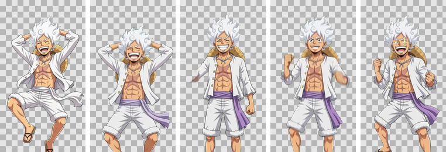

# vidsticker ✂️

Turn a video into a transparent animated sticker — GIF, WebP or APNG — with the
background cut away.

Comes as a CLI and a small browser UI.

```bash
vidsticker clip.mp4            # -> out/clip.gif + out/clip.webp
vidsticker --serve             # -> browser UI on http://127.0.0.1:8000
```

<p align="center">
  
</p>

---

## How the background removal works

Most tools pick one of two strategies. Each fails on its own:

| | edges | knows what the subject is |
|---|---|---|
| **Chroma key** | pixel-accurate | ✗ — keeps *anything* that isn't the screen colour: light rays, lens flares, sparkle overlays |
| **Neural matte** | soft, approximate | ✓ |

So vidsticker runs both and takes the **per-pixel minimum** of the two alphas.
The key defines the edge; the network defines what counts as subject. A pixel
has to convince both to survive.

The rest of the pipeline exists because real footage breaks the naive version of
that idea:

- **The key is re-detected on every frame.** An animated backdrop — light rays,
  a flicker, a pulsing gradient — shifts the screen colour as the clip runs. One
  clip-wide key leaves patches of backdrop behind on the frames it doesn't fit.
- **Despill** clamps the screen colour where it has bled onto the subject, so
  edges don't keep a green rim.
- **A 3-frame temporal median** on the matte removes the single-frame speckle a
  per-frame network produces, without smearing genuine motion.
- **One crop box for the whole clip**, taken from the union of every frame's
  content, so the sticker is tight but the subject never drifts or jitters
  inside the frame.

On a source without a coloured screen, `auto` detects that there's no key and
falls back to the neural matte alone.

## Install

```bash
pip install -r requirements.txt        # or: pip install -e .
```

Needs **ffmpeg** on `PATH` (`apt install ffmpeg` / `brew install ffmpeg`).
Segmentation models download themselves on first use (~180 MB, cached in
`~/.u2net`).

## CLI

```bash
vidsticker clip.mp4                          # GIF + WebP, auto matte, 512 px
vidsticker clip.mp4 -o stickers --size 320
vidsticker clip.mp4 --formats gif webp apng --square
vidsticker clip.mp4 --mode ai                # ignore the backdrop colour
vidsticker clip.mp4 --start 2 --duration 4   # trim
```

| flag | what it does |
|---|---|
| `--size N` | longest edge in px (default 512) |
| `--fps N` | output rate; defaults to the source, snapped for GIF (see below) |
| `--formats` | any of `gif webp apng` (default `gif webp`) |
| `--mode` | `auto` · `hybrid` · `chroma` · `ai` |
| `--model` | `isnet-general-use` (default), `isnet-anime`, `u2net_human_seg`, `birefnet-general`, … |
| `--square` | pad the crop to a square canvas |
| `--no-crop` | keep the original framing |
| `--tolerance` / `--softness` | chroma radius kept transparent / width of the edge ramp |
| `--despill` | screen-colour spill removal, `0`–`1` (default 0.8) |
| `--shrink` / `--feather` | erode / blur the matte edge |
| `--no-smooth` | disable the temporal median |
| `--alpha-threshold` | GIF alpha cutoff, `1`–`255` (default 128) |

`vidsticker --help` lists the rest.

### Picking a model

`isnet-general-use` is a good default. Switch when the subject is unusual:

- **`isnet-anime`** — illustration and anime. Noticeably better at *interior*
  gaps: the slot between an arm and a sleeve, gaps between fingers. Roughly 3×
  slower.
- **`u2net_human_seg`** — a person filling the frame.
- **`birefnet-general`** — the best edges available here, and the slowest by a
  wide margin.

## Browser UI

```bash
vidsticker --serve --port 8000
```

Drag a video in, watch the stages stream past, download the result. Conversions
run on a worker thread and report progress over server-sent events, so a
multi-minute job stays responsive.

It's built for local use — jobs live in temp directories, are held in memory,
and are reaped an hour after they finish. Put a real WSGI server and an
authenticating proxy in front of it before exposing it to a network.

## Python API

```python
from pathlib import Path
from vidsticker import MatteConfig, StickerOptions, create_sticker

result = create_sticker(
    Path("clip.mp4"), Path("out"),
    StickerOptions(size=512, formats=["gif", "webp"],
                   matte=MatteConfig(mode="auto", model="isnet-anime")),
    progress=lambda stage, done, total: print(stage, done, total),
)
print(result.summary)
```

## Format notes

**GIF carries only one bit of alpha** and 256 colours, so soft edges get
thresholded at `--alpha-threshold`. It's also limited to delays in whole
hundredths of a second — a 24 fps source wants 4.1666 cs and every decoder
rounds it differently, so when GIF is a target vidsticker resamples to the
nearest rate GIF can represent exactly (25 fps here). Clip length is preserved.

**WebP and APNG carry real 8-bit alpha**, so soft edges survive instead of being
cut to a hard 1-bit stencil. WebP is smaller than the GIF as well (5.7 MB vs
7.1 MB on the example below, and the gap widens as you drop `--webp-quality`).
APNG is lossless and much larger. If whatever you're pasting into takes WebP,
prefer it — GIF is the compatibility option, not the good one.

## Worked example

`examples/` holds the output for a 6 s, 1080×1920 clip of an anime character on
a green screen — with animated gold light rays and sparkles drifting across the
backdrop, which is exactly the case a plain chroma key gets wrong.

```bash
vidsticker luffy.mp4 -o examples --model isnet-anime --formats gif webp
```

```
Matte: hybrid (chroma key Cr/Cb 84/101)
Output: 150 frames @ 25 fps, 288x512 px
  gif   examples/luffy-sticker.gif   (7.11 MB)
  webp  examples/luffy-sticker.webp  (5.73 MB)
```

What each stage contributed:

- **Chroma key alone** kept every gold ray and sparkle — they aren't green, so
  the key has no reason to drop them.
- **Neural matte alone** dropped the sparkles but left a green fringe hugging
  the silhouette.
- **The hybrid** cleared both. Measured over all 150 output frames, 4 opaque
  pixels remain that are green-dominant, out of ~8.4 million.
- **Per-frame keying** mattered here: the rays wash the backdrop out as the clip
  runs, moving the key from Cr/Cb 59/93 to 86/103. Held at one clip-wide key,
  the opening frames' backdrop stayed 80% opaque.
- **`isnet-anime`** over the default model closed the interior gaps — the slot
  between a sleeve and a forearm, which the general model filled in solid.

A compact variant for messaging apps with size limits:

```bash
vidsticker luffy.mp4 --size 320 --fps 12.5 --colors 160
```

## Tuning a stubborn clip

| symptom | try |
|---|---|
| green rim around the subject | raise `--despill`, or `--shrink 1` |
| holes in the subject | lower `--tolerance`; the subject may share the backdrop's colour |
| background survives in patches | `--mode ai`, or a model better matched to the subject |
| background survives in *interior gaps* | a stronger model — `isnet-anime`, `birefnet-general` |
| jagged GIF edges | lower `--alpha-threshold` (~96), or output WebP |
| file too big | `--size 320`, `--fps 15`, `--colors 128` |
| edges flicker between frames | ensure `--no-smooth` is *not* set |

## Tests

```bash
python -m pytest tests/ -q
```

They build a synthetic green-screen clip and run it end to end in `chroma` mode —
ffmpeg required, no model download, no network.

## License

MIT
